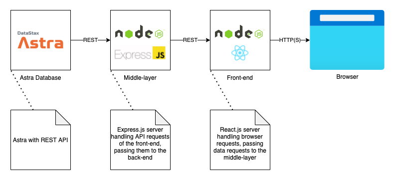

# Getting started with DataStax Astra, Express and React
This repository shows an end-to-end way to build a React front-end with an Express middle layer communicating to DataStax Astra.



## 1️⃣ Set up the middle layer
### Generate the basic Express setup
```sh
npx express-generator api
```
### Change the port number for the middle layer
Inside the `api` directory, go to `bin/www` and change the port number on line 15 from `3000` to `9000`.
### Create a middle layer service
On `api/routes`, create a `testAPI.js` file and paste this code:
```js
var express = require("express");
var router = express.Router();

router.get("/", function(req, res, next) {
    res.send("API is working properly");
});

module.exports = router;
```
### Tell Express to use the new service
On the `api/app.js` file, insert a new route on line 24:
```js
app.use("/testAPI", testAPIRouter);
```
Ok, you are “telling” express to use this route but, you still have to require it. Let’s do that on line 9:
```js
var testAPIRouter = require("./routes/testAPI");
```
### Allow cross-origin requests in the middle layer
```sh
cd api
npm install --save cors
```
On your code editor go to the API directory and open the `api/app.js` file.
On line 6 require CORS:
```js
var cors = require("cors");
```
Now on line 18 “tell” express to use CORS:
```js
app.use(cors());
```
### 🚀 Test your new service
Build and start your middle layer:
```sh
cd api
npm install
npm start
```
Now browse to http://localhost:9000/testAPI and you will see the message: "API is working properly."

## 2️⃣ Set up the front-end
### Generate the basic Express setup
```sh
npx create-react-app front-end
```
### Call the middle layer API from the front-end
Update file `frontend/src/App.js` to the following:
```js
import React, { Component } from 'react';
import logo from './logo.svg';
import './App.css';

class App extends Component{
  constructor(props) {
    super(props);
    this.state = { apiResponse: "" };
  }

  callApi() {
    fetch("http://localhost:9000/testAPI")
      .then(res => res.text())
      .then(res => this.setState({ apiResponse: res }))
      .catch(err => err);
  }

  componentDidMount() {
    this.callApi();
  }

    render() {
        return (
        <div className="App">
            <header className="App-header">
            
            <p className="App-intro">{this.state.apiResponse}</p>
            </header>
        </div>
        );
    }
}

export default App;
```
### 🚀 Test the front-end, talking to the middle layer
Open another terminal and run:
```sh
cd front-end
npm start
```
Now browse to http://localhost:3000 and you will see the message: "API is working properly."

Congratulations! You just created a React front-end that calls a service in the Express middle-layer!

## 3️⃣ Let the middle layer communicate with the DataStax Astra backend
### Add dependencies
In the `api` directory run:
```sh
npm install @astrajs/collections @astrajs/rest@0.0.12 dotenv --save
```
### Set up Astra configuration
First create a `.env` file in the `api/` directory and fill in the correct settings for your database. You can find these on the Connect tab underneath the REST option in the Astra Management interface (https://astra.datastax.com).
```sh
ASTRA_DB_ID=
ASTRA_DB_REGION=
ASTRA_DB_KEYSPACE=
ASTRA_DB_APPLICATION_TOKEN=
```
### Call Astra REST endpoints
Then update the `testAPI.js` file to set up the connection with Astra and retrieve all tables in your keyspace:
```js
var express = require("express");
var router = express.Router();

// Retrieve settings from .env file
require('dotenv').config();

var astraRest = require("@astrajs/rest");
var astraClient;
var restBasePath = "/api/rest/v2/keyspaces/" + process.env.ASTRA_DB_KEYSPACE;
var restSchemaPath = "/api/rest/v1/keyspaces/" + process.env.ASTRA_DB_KEYSPACE + "/tables/";

// Create an astra client if not available
async function getAstraClient() {
    if (!astraClient) {
        astraClient = await astraRest.createClient({
            astraDatabaseId: process.env.ASTRA_DB_ID,
            astraDatabaseRegion: process.env.ASTRA_DB_REGION,
            authToken: process.env.ASTRA_DB_APPLICATION_TOKEN,
        });
    }
    return astraClient;
}

// Get all tables
async function getTables() {
    astraClient = await getAstraClient();
    var tables = await astraClient.get(restSchemaPath);
    return tables;
}

// Listen
router.get("/", function(req, res, next) {
    getTables().then(function(data){
        res.send(data.data);
      }).catch(function(err){
        res.send("Exception: " + err);
      })
});

module.exports = router;
```
### 🚀 Watch the magic happen in the middle layer
Ctrl-c the middle layer and restart:
```sh
npm start
```
Now browse to http://localhost:9000/testAPI and you will see all tables in your keyspace.

### 🚀 Watch the magic happen in the browser
Reload your page and watch what happens on http://localhost:3000
